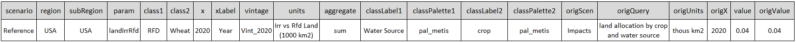
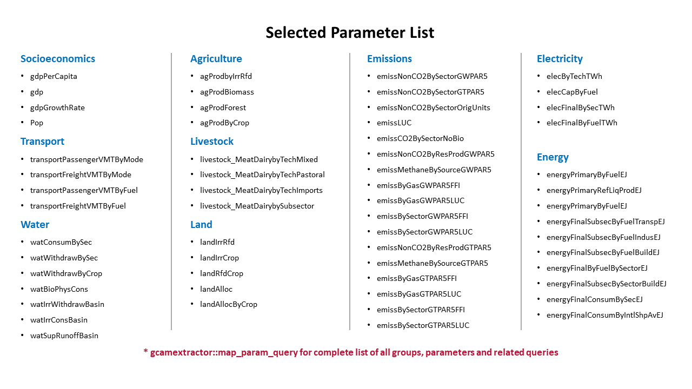

<!-------------------------->
<!-------------------------->
# Read GCAM database
<!-------------------------->
<!-------------------------->
<p align="center"> </p>

`gcamextractor::readgcam` will return a list containing: 

* data: a dataframe with the original data
* dataAggParam: a dataframe with the data aggregated to the parameter
* dataAggClass1: a dataframe with the data aggregated to class 1
* dataAggclass2: a dataframe with the data aggregated to class 2
* dataAll: a dataframe with the original data as well as original queries and values before any conversions
* scenarios: A list of the scenarios
* queries: A list of the queries used to extract the data

```{r, eval=F}

library(gcamextractor)

path_to_gcam_database <- "E:/gcamfolder/output/database_ref" # Change the path based on your GCAM database location
gcamextractor::data_params # view available parameters
dataGCAM <- gcamextractor::readgcam(gcamdatabase = path_to_gcam_database,
                                    regionsSelect = c("Colombia"), # Set to "All" to read in all available regions
                                    paramsSelect = "pop",
                                    folder = "my_output_folder")  # Set to "All" to read in all available params

df <- dataGCAM$data; df
dfParam <- dataGCAM$dataAggParam; dfParam
dfClass1 <- dataGCAM$dataAggClass1; dfClass1
dfClass2 <- dataGCAM$dataAggClass1; dfClass2


``` 


<!-------------------------->
<!-------------------------->
# Read GCAM .Proj file
<!-------------------------->
<!-------------------------->
<p align="center"> </p>

`gcamextractor` includes a default example .Proj file `gcamextractor::exmapleGCAMproj`.

```{r, eval=F}
library(gcamextractor)

dataGCAM <- gcamextractor::readgcam(dataProjFile = gcamextractor::example_gcamv54_argentina_colombia_2025_proj,
                                    folder = "my_output_folder")

```

Users can provide path to .Proj file to read GCAM data.

```{r, eval=F}
library(gcamextractor)

path_to_gcam_projfile <- "E:/my_proj_file.proj" # Change path to your proj file. This is an output of gcam extractor.
dataGCAM <- gcamextractor::readgcam(gcamdatabase = path_to_gcam_projfile,
                                    folder = "my_output_folder")

```

<!-------------------------->
<!-------------------------->
# Output Structure
<!-------------------------->
<!-------------------------->
<p align="center"> </p>

<p align="center"> </p>


<!-------------------------->
<!-------------------------->
# Available Paramaters
<!-------------------------->
<!-------------------------->
<p align="center"> </p>

Users can get a list of all available params and queries as follows. 
Key words can be used to get params grouped by selected sectors.

```{r, eval=F}
library(gcamextractor)

gcamextractor::data_params # Get all params
gcamextractor::data_queries # Get all queries used
gcamextractor::map_param_query # Get a table of params and the relevants queries used to extract and calculate them.

```

<!-- Add params list figure -->
<p align="center"> </p>

<!-------------------------->
## Socioeconomics
<!-------------------------->

<a name="table1"></a>
**Table 1:** Summary of parameters for socioeconomics.

| Parameter | Description and Unit | Original GCAM Unit | Source Queries |
|---|---|---|---|
| [gdpPerCapita](#gdppercapita) | GDP per Capita (Thousand 1990 USD per Person) | Thousand 1990 USD per Person | GDP per capita MER by region |
| [gdp](#gdp) | GDP (Billion 1990 USD) | Million 1990 USD | GDP MER by region |
| [gdpGrowthRate](#gdpgrowthrate) | GDP Growth Rate (Percent) | Million 1990 USD | GDP MER by region |
| [pop](#pop) | Population (Millions) | Thousands | Population by region |

<br />

<!-- ### gdpPerCapita -->

<!-- <br /> -->

<!-- ### gdp -->

<!-- <br /> -->

<!-- ### gdpGrowthRate -->

<!-- <br /> -->

<!-- ### pop -->

<!-- <br /> -->


<!-------------------------->
## Transport
<!-------------------------->
<a name="table2"></a>
**Table 2:** Summary of parameters for transport.

| Parameter | Description and Unit<sup>*</sup> | Original GCAM Unit | Source Queries |
|---|---|---|---|
| [transportPassengerVMTByMode](#transportpassengervmtbymode) | Passenger VMT (services) by Mode (million pass-km) | million pass-km | transport service output by mode |
| [transportFreightVMTByMode](#transportfreightvmtbymode) | Freight VMT (services) by Mode (million ton-km) | million ton-km | transport service output by mode |
| [transportPassengerVMTByFuel](#transportpassengervmtbyfuel) | Passenger VMT (services) by Fuel (million pass-km) | million pass-km | transport service output by tech (new) |
| [transportFreightVMTByFuel](#transportfreightvmtbyfuel) | Freight VMT (services) by Fuel (million ton-km) | million ton-km | transport service output by tech (new) |

<sub>\*Passenger VMT modes: 2W and 3W, bus, car, large car and truck, LDV, plane, and rail.</sub> \
<sub>\*Freight VMT modes: heavy truck, light truck, medium truck, rail, and ship.</sub> \
<sub>\*Passenger VMT fuel: biofuel, electricity, fossil fuel, gas, hydrogen, and LA-electricity.</sub> \
<sub>\*Freight VMT fuel: biofuel, coal, electricity, fossil fuel, gas.</sub>

<br />

<!-- ### transportPassengerVMTByMode -->

<!-- <br /> -->

<!-- ### transportFreightVMTByMode -->

<!-- <br /> -->

<!-- ### transportPassengerVMTByFuel -->

<!-- <br /> -->

<!-- ### transportFreightVMTByFuel -->

<!-- <br /> -->

<!-------------------------->
## Water
<!-------------------------->

<a name="table3"></a>
**Table 3:** Summary of parameters for water.

| Parameter | Description and Unit<sup>*</sup> | Original GCAM Unit | Source Queries |
|---|---|---|---|
| [watConsumBySec](#watconsumbysec) | Water Consumption by Sector (km3) | km3 | water consumption by state, sector, basin (includes desal) |
| [watWithdrawBySec](#watwithdrawbysec) | Water Withdrawal by Sector (km3) | km3 | water withdrawals by state, sector, basin (includes desal) |
| [watWithdrawByCrop](#watwithdrawbycrop) | Water Withdrawals by Crop (km3) | km3 | water withdrawals by crop |
| [watBioPhysCons](#watbiophyscons) | Biophysical Water Consumption (km3) | km3 | biophysical water demand by crop type and land region |
| [watIrrWithdrawBasin](#watirrwithdrawvasin) | Irrigation Water Withdrawal (km3) | km3 | water withdrawals by water mapping source |
| [watIrrConsBasin](#watirrconsbasin) | Irrigation Water Consumption (km3) | km3 | water consumption by water mapping source |
| [watSupRunoffBasin](#watsuprunoffbasin) | Runoff (km3) | km3 | Basin level available runoff |
| [waterWithdrawROGW](#waterwithdrawrogw) | Runoff vs Groundwater (km3) | km3 | Water withdrawals by water source (runoff vs. groundwater) |

<sub>\*Water consumption sectors: animal, domestic, electric, industry, irrigation, and primary.</sub> \
<sub>\*Water withdrawal sectors: agriculture, electricity, industry, livestock, mining, municipal, and desalination.</sub> \
<sub>\*Crop: biomass, corn, fibercrop, fodderherb, miscellaneous crop, oil crop, other grain, palm fruit, rice, root tuber, sugar crop, wheat, and fodder grass.</sub>


<br />

<!-- ### watConsumBySec -->

<!-- <br /> -->

<!-- ### watWithdrawBySec -->

<!-- <br /> -->

<!-- ### watWithdrawByCrop -->

<!-- <br /> -->


<!-- ### watBioPhysCons -->

<!-- <br /> -->

<!-- ### watIrrWithdrawBasin -->

<!-- <br /> -->

<!-- ### watIrrConsBasin -->

<!-- <br /> -->

<!-- ### watSupRunoffBasin -->

<!-- <br /> -->

<!-- ### waterWithdrawROGW -->

<!-- <br /> -->

<!-------------------------->
## Agriculture
<!-------------------------->

<a name="table4"></a>
**Table 4:** Summary of parameters for agriculture.

| Parameter | Description and Unit | Original GCAM Unit | Source Queries |
|---|---|---|---|
| [agProdbyIrrRfd](#agprodbyirrrfd) | Agricultural Production (Mt) | Mt | ag production by tech |
| [agProdBiomass](#agprodbiomass) | Biomass Production (EJ) | EJ | ag production by tech |
| [agProdForest](#agprodforest) | Forest Production (billion m3) | billion m3 | ag production by tech |
| [agProdByCrop](#agprodbycrop) | Crop Production (Mt) | Mt | ag production by tech |


<br />

<!-- ### agProdbyIrrRfd -->

<!-- <br /> -->

<!-- ### agProdBiomass -->

<!-- <br /> -->

<!-- ### agProdForest -->

<!-- <br /> -->

<!-- ### agProdByCrop -->

<!-- <br /> -->

<!-------------------------->
## Livestock
<!-------------------------->

<a name="table5"></a>
**Table 5:** Summary of parameters for livestock.

| Parameter | Description and Unit | Original GCAM Unit | Source Queries |
|---|---|---|---|
| [livestock_MeatDairybyTechMixed](#livestock_meatdairybytechmixed) | Livestock Production Mixed Feed (Mt) | Mt | meat and dairy production by tech |
| [livestock_MeatDairybyTechPastoral](#livestock_meatdairybytechpastoral) | Livestock Production Pastoral (Mt) | Mt | meat and dairy production by tech |
| [livestock_MeatDairybyTechImports](#livestock_meatdairybytechimports) | Livestock Production Imported Feed (Mt) | Mt | meat and dairy production by tech |
| [livestock_MeatDairybySubsector](#livestock_meatdairybysubsector) | Livestock Production (Mt) | Mt | meat and dairy production by tech |

<br />

<!-- ### livestock_MeatDairybyTechMixed -->

<!-- <br /> -->

<!-- ### livestock_MeatDairybyTechPastoral -->

<!-- <br /> -->

<!-- ### livestock_MeatDairybyTechImports -->

<!-- <br /> -->

<!-- ### livestock_MeatDairybySubsector -->

<!-- <br /> -->

<!-------------------------->
## Land Use
<!-------------------------->

<a name="table6"></a>
**Table 6:** Summary of  parameters for land use.

| Parameter | Description and Unit<sup>*</sup> | Original GCAM Unit | Source Queries |
|---|---|---|---|
| [landIrrRfd](#landirrrfd) | Irrigated vs Rainfed Land (1000 km2) | 1000 km2 | land allocation by crop and water source |
| [landIrrCrop](#landirrcrop) | Irrigated Crop Land (1000 km2) | 1000 km2 | land allocation by crop and water source |
| [landRfdCrop](#landrfdcrop) | Rainfed Crop Land (1000 km2) | 1000 km2 | land allocation by crop and water source |
| [landAlloc](#landalloc) | Land Allocation by Aggregated Land Type (1000 km2) | 1000 km2 | aggregated land allocation |
| [landAllocByCrop](#landallocbycrop) | Cropland Allocation (1000 km2) | 1000 km2 | land allocation by crop |
| [landAllocDetail](#landallocdetail) | Land Allocation by Detailed Land Type (1000 km2) | 1000 km2 | detailed land allocation |

<sub>\*Aggregated land type: crops, forest, natural other, natural other grass, natural other tree, pasture, and crop</sub> \
<sub>\*Detailed land type: biomassGrass, biomassTree, Corn, FiberCrop, Forest, Grassland, MiscCrop, OilCrop, OtherArableLand, OtherGrain, PalmFruit, Pasture, ProtectedGrassland, ProtectedShrubland, ProtectedUnmanagedForest, ProtectedUnmanagedPasture, Rice, RootTuber, Shrubland, SugarCrop, UnmanagedForest, UnmanagedPasture, UrbanLand, Wheat, FodderGrass, FodderHerb, RockIceDesert, and Tundra</sub>

<br />

<!-- ### landIrrRfd -->

<!-- <br /> -->

<!-- ### landIrrCrop -->

<!-- <br /> -->

<!-- ### landRfdCrop -->

<!-- <br /> -->

<!-- ### landAlloc -->

<!-- <br /> -->

<!-- ### landAllocByCrop -->

<!-- <br /> -->

<!-- ### landAllocDetail -->

<!-- <br /> -->

<!-------------------------->
## Emissions
<!-------------------------->

<a name="table7"></a>
**Table 7:** Summary of parameters for emissions.

| Parameter | Description and Unit | Original GCAM Unit | Source Queries |
|---|---|---|---|
| [emissNonCO2BySector](#emissnonco2bysector) | GHG Emissions (non CO2) by Gas Type (Gg/Tg/MTC) | Gg/Tg/MTC  | nonCO2 emissions by sector; <br /> nonCO2 emissions by sector USA; <br /> nonCO2 emissions by sector USA nonUS |
| [emissNonCO2BySectorGWPAR5](#emissnonco2bysectorgwpar5) | GHG Emissions GWP AR5 (MTCO2eq) | Gg/Tg/MTC  | nonCO2 emissions by sector; <br /> nonCO2 emissions by sector USA |
| [emissNonCO2BySectorGTPAR5](#emissnonco2bysectorgtpar5) | GHG Emissions GTP AR5 (MTCO2eq) | Gg/Tg/MTC  | nonCO2 emissions by sector; <br /> nonCO2 emissions by sector USA |
| [emissNonCO2BySectorOrigUnits](#emissnonco2bysectororigunits) | GHG Emissions by Gas Type (Gg/Tg/MTC) | Gg/Tg/MTC  | nonCO2 emissions by sector |
| [emissNonCO2ByResProdGWPAR5](#emissnonco2byresprodgwpar5) | Non-CO2 Emissions by Resource  Production GWP AR5 (MTCO2eq) | Tg  | nonCO2 emissions by resource production |
| [emissNonCO2ByResProdGTPAR5](#emissnonco2byresprodgtpar5) | Non-CO2 Emissions by Resource Production GTP AR5 (MTCO2eq) | Tg  | nonCO2 emissions by resource production |
| [emissCO2BySector](#emissco2bysector) | CO2 Emission (MTC) | MTC  | CO2 emissions by sector |
| [emissCO2BySectorNoBio](#emissco2bysectornobio) | CO2 Emission without Bio (MTCO2eq) | MTC  | CO2 emissions by sector (no bio) |
| [emissLUC](#emissluc) | LUC CO2 Emissions (MTCO2eq) | MTC  | Land Use Change Emission (future) |
| [emissBySectorGTPAR5FFI](#emissbysectorgtpar5ffi) | Emissions from Fossil FUels and Industry (FFI) but LUC GTP AR5 (MTCO2eq) | MTC  | nonCO2 emissions by resource production; <br /> nonCO2 emissions by sector |
| [emissBySectorGTPAR5LUC](#emissbysectorgtpar5luc) | Emissions from Landuse Change (LUC) GTP AR5 (MTCO2eq) | MTC  | nonCO2 emissions by resource production; <br /> nonCO2 emissions by sector |
| [emissByGasGTPAR5FFI](#emissbygasgtpar5ffi) | Total Emissions without LUC GTP AR5 Summarized (MTCO2eq) | MTC  | nonCO2 emissions by resource production; <br /> nonCO2 emissions by sector |
| [emissByGasGTPAR5LUC](#emissbygasgtpar5luc) | Total Emissions with LUC GTP AR5 Summarized (MTCO2eq) | MTC  | nonCO2 emissions by resource production; <br /> nonCO2 emissions by sector |
| [emissMethaneBySourceGWPAR5](#emissmethanebysourcegwpar5) | Methane Emissions GWP AR5 (MTCO2eq) | Tg  | nonCO2 emissions by sector |
| [emissMethaneBySourceGTPAR5](#emissmethanebysourcegtpar5) | Methane Emissions GTP AR5 (MTCO2eq) | Tg  | nonCO2 emissions by sector |


<br />

<!-- ### emissNonCO2BySector -->

<!-- <br /> -->

<!-- ### emissNonCO2BySectorGWPAR5 -->

<!-- <br /> -->

<!-- ### emissNonCO2BySectorGTPAR5 -->

<!-- <br /> -->

<!-- ### emissNonCO2BySectorOrigUnits -->

<!-- <br /> -->

<!-- ### emissNonCO2ByResProdGWPAR5 -->

<!-- <br /> -->

<!-- ### emissNonCO2ByResProdGTPAR5 -->

<!-- <br /> -->

<!-- ### emissCO2BySector -->

<!-- <br /> -->

<!-- ### emissCO2BySectorNoBio -->

<!-- <br /> -->

<!-- ### emissBySectorGTPAR5FFI -->

<!-- <br /> -->

<!-- ### emissBySectorGTPAR5LUC -->

<!-- <br /> -->

<!-- ### emissMethaneBySourceGWPAR5 -->

<!-- <br /> -->

<!-- ### emissMethaneBySourceGTPAR5 -->

<!-- <br /> -->


<!-------------------------->
## Electricity
<!-------------------------->
<a name="table8"></a>
**Table 8:** Summary of parameters for electricity.

| Parameter | Description and Unit<sup>*</sup> | Original GCAM Unit | Source Queries |
|---|---|---|---|
| [elecByTechTWh](#elecbytechtwh) | Electricity Generation by Fuel (TWh) | EJ | elec gen by gen tech USA; <br /> elec gen by gen tech and cooling tech |
| [elecCapByFuel](#eleccapbyfuel) | Electricity Capacity by Fuel (GW) | EJ | elec gen by gen tech USA; <br /> elec gen by gen tech and cooling tech |
| [elecFinalBySecTWh](#elecfinalbysectwh) | Final Electricity by Sector (TWh) | EJ | inputs by tech |
| [elecFinalByFuelTWh](#elecfinalbyfueltwh) | Final Electricity (TWh) | EJ | Final energy by detailed end-use sector and fuel |

<sub>\*Fuel: biomass, coal, gas, geothermal, hydro, nuclear, refined liquids, solar, and wind.</sub> \
<sub>\*Final electricity sectors: building, industry, and transport.</sub>

<br />


### elecByTechTWh

`elecByTechTWh` uses "elec gen by gen tech and cooling tech" query and converts electricity generation of GCAM raw output from EJ to TWh:

$$elecByTechTWh = elecByTechEJ_{GCAM} \times convEJ2TWh$$
where `convEJ2TWh` is the conversion constant from EJ to TWh, 1 EJ = 277.7778 TWh.
`gcamextractor::readgcam` also aggregates "rooftop_pv" into "solar" category in the technology subsector (shown in "class1" colomn).

```{r eval=F}
library(gcamextractor)

dataGCAM <- gcamextractor::readgcam(dataProjFile = gcamextractor::example_GCAMv52_2050_proj,
                                    paramsSelect = 'elecByTechTWh',
                                    regionsSelect = 'USA',
                                    folder = "my_output_folder")
```


<br />


### elecCapByFuel

`elecCapByFuel` calculates electricity capacity (GW) based on the output from `elecByTechTWh`:

$$elecCapByFuel = \frac{elecByTechTWh \times 1000}{8760 \times gcamCapacityFactor}$$

`gcamCapacityFactor` is calculated as an average of the capacity factors of the technologies within each subsector (See [Table GCAM Capacity Factors](#table_gcamCapacityFactor)) based on the data from:

  - Global technology capacity factor from "GCAM-FOLDER\\input\\gcamdata\\inst\\extdata\\energy\\A23.globaltech_capacity_factor.csv"
  - USA renewable technology capacity factors by States from "GCAM-FOLDER\\input\\gcamdata\\inst\\extdata\\gcam-usa\\NREL_us_re_capacity_factors.csv"
  - Hydrogen fuel cell capacity factor from https://www.eia.gov/todayinenergy/detail.php?id=35872 and https://www.nrel.gov/analysis/tech-cap-factor.html

Exceptions in calculating `gcamCapacityFactor` include:

  - For "solar" capacity factor the CSP_storage capacity factor value of 0.65 was excluded from the average.
  - The "hydro" capacity factor was sourced from Global CCS Institute "Renewable power generation costs in 2012: an overview" - 5.2 Capacity factors for hydropower, since hydropower is calculated endogenously within GCAM.
  - No cogeneration capacity factor "n CHP" was given.
  - rooftop_pv was assumed the same as solar average (5) grid_storage assumed to have a high cap factor equal to that of nuclear

<a name="table_gcamCapacityFactor"></a>
**Table GCAM Capacity Factors:** Averaged capacity factor for electricity generation by generation technology.

| Subsector (class1) | Average capacity factor from 1971 to 2100 |
|---|---|
| coal | 0.8125 |
| gas | 0.816667 |
| oil | 0.816667 |
| biomass | 0.825 |
| nuclear | 0.9 |
| geothermal | 0.9 |
| hydro | 0.5 |
| wind | 0.37 |
| solar | 0.216667 |
| rooftop_pv | 0.216667 |
| hydrogen | 0.8 |
| grid_storage | 0.9 |

```{r eval=F}
library(gcamextractor)

dataGCAM <- gcamextractor::readgcam(dataProjFile = gcamextractor::example_GCAMv52_2050_proj,
                                    paramsSelect = 'elecCapByFuel',
                                    regionsSelect = 'USA',
                                    folder = "my_output_folder")
```

<br />


<!-- ### elecFinalBySecTWh -->

<!-- <br /> -->

<!-- ### elecFinalByFuelTWh -->

<!-- <br /> -->


<!-------------------------->
## Energy
<!-------------------------->

<a name="table9"></a>
**Table 9:** Summary of parameters for energy.

| Parameter | Description and Unit<sup>*</sup> | Original GCAM Unit | Source Queries |
|---|---|---|---|
| [energyPrimaryByFuelEJ](#energyprimarybyfuelej) | Primary Energy Consumption by Fuel (EJ) | EJ | primary energy consumption by region (direct equivalent) |
| [energyPrimaryRefLiqProdEJ](#energyprimaryrefliqprodej) | Refined Liquids Production (EJ) | EJ | refined liquids production by subsector |
| [energyFinalConsumBySecEJ](#energyfinalconsumbysecej) | Final Energy by Sector (EJ) | EJ | total final energy by aggregate sector |
| [energyFinalByFuelBySectorEJ](#energyfinalbyfuelbysectorej) | Final Energy by Fuel (EJ) | EJ | Final energy by detailed end-use sector and fuel |
| [energyFinalSubsecByFuelTranspEJ](#energyfinalsubsecbyfueltranspej) | Transport Final Energy by Fuel (EJ) | EJ | transport final energy by fuel |
| [energyFinalSubsecByFuelBuildEJ](#energyfinalsubsecbyfuelbuildej) | Building Final Energy by Fuel (EJ) | EJ | building final energy by fuel |
| [energyFinalSubsecByFuelIndusEJ](#energyfinalsubsecbyfuelindusej) | Industry Final Energy by Fuel (EJ) | EJ | industry final energy by fuel |
| [energyFinalSubsecBySectorBuildEJ](#energyfinalsubsecbysectorbuildej) | Building Final Energy By Subsector (EJ) | EJ | building final energy by subsector |
| [energyFinalConsumByIntlShpAvEJ](#energyfinalconsumbyintlshpavej) | Final Energy International Aviation and Ship (EJ) | EJ | transport final energy by mode and fuel |

<sub>\*Final energy sectors: building, industry, transport, transport international aviation, and transport international ship.</sub> \
<sub>\*Building final energy subsectors: commercial cooling and heating, commercial others, residential cooling and heating, and residential others.</sub> \
<sub>\*Final energy fuel: biomass, coal, electricity, gas, hydrogen, liquids, liquids av, liquids shp, and other.</sub>

<br />

<!-- ### energyPrimaryByFuelEJ -->

<!-- <br /> -->

<!-- ### energyPrimaryRefLiqProdEJ -->

<!-- <br /> -->

<!-- ### energyFinalConsumBySecEJ -->

<!-- <br /> -->

<!-- ### energyFinalByFuelBySectorEJ -->

<!-- <br /> -->

<!-- ### energyFinalSubsecByFuelTranspEJ -->

<!-- <br /> -->

<!-- ### energyFinalSubsecByFuelBuildEJ -->

<!-- <br /> -->

<!-- ### energyFinalSubsecByFuelBuildEJ -->

<!-- <br /> -->

<!-- ### energyFinalSubsecByFuelIndusEJ -->

<!-- <br /> -->

<!-- ### energyFinalSubsecBySectorBuildEJ -->

<!-- <br /> -->

<!-- ### energyFinalConsumByIntlShpAvEJ -->

<!-- <br /> -->


<!-------------------------->
<!-------------------------->
# Data for Specific Models
<!-------------------------->
<!-------------------------->
<p align="center"> </p>

<!-------------------------->
## CERF
<!-------------------------->

Use `cerf` for the `paramSelect` argument in `gcamextractor` to extract the relevant variables needed for the `CERF` model (https://github.com/IMMM-SFA/cerf).

```{r eval=F}
library(gcamextractor)

path_to_gcam_database <- "E:/gcamfolder/output/database_ref" # Change to your path.
path_to_gcam_projfile <- "E:/my_proj_file.proj" # Change to your .proj file path.
path_to_gcamdata_folder <- "E:/gcamfolder/input/gcamdata"
gcamextractor::data_params # view available parameters
dataGCAM <- gcamextractor::readgcam(gcamdatabase = path_to_gcam_database,
                                    dataProjFile = path_to_gcam_projfile # Optional. Or cerf_proj_file.proj
                                    gcamdata_folder = path_to_gcamdata_folder,
                                    paramsSelect = "cerf",
                                    folder = "cerf")  # Set to "All" to read in all available params

df <- dataGCAM$data; df
dfParam <- dataGCAM$dataAggParam; dfParam
dfClass1 <- dataGCAM$dataAggClass1; dfClass1
dfClass2 <- dataGCAM$dataAggClass1; dfClass2

```

The parameters extracted for CERF are as follows with links to the relevant parameters explanation:

<a name="table_cerf"></a>
**Table: CERF**

```{r, results = 'show', eval=TRUE, echo=FALSE, warning=FALSE, error = FALSE, message = FALSE}
library(pander)
mytable = data.frame(
    Parameter     = c("elec_lifetime_yr",
                      "elec_lifetime_scurve_yr",
                      "elec_capacity_factor_usa_in",
                      "elec_variable_om_2015USDperMWh",
                      "elec_variable_om_escl_rate_2015USDperMWh",
                      "elec_fuel_escl_rate_2015USDperMBTU",
                      "elec_fuel_price_escl_rate_2015USDperMBTU",
                      "elec_cap_usa_GW",
                      "energy_fuel_co2_content_tonsperMWh"),
    Description = c("Technology Lifetime (Yr)",
                    "Base year S-Curve Lifetime, Steepness, half life",
                    "Capacity Factor assumptions for US States by investment segments (baseline, intermediate, subpeak, peak",
                    "Variable OnM cost (2015 USD/MWh)",
                    "Variable OnM cost escalation rate (2015 USD/MWh)",
                    "Fuel price (2015 USD/MBTU)",
                    "Fuel price escalation rate (2015 USD/MBTU)",
                    "Installed Capacity in GW",
                    "Fuel CO2 Content"
                    ),
    Unit     = c("year",
                 "* lifetime (yr)\
                 \n* steepness (no units)\
                 \n* half life (yr)",
                 "None",
                 "2015 USD/MWh",
                 "2015 USD/MWh",
                 "2015 USD/MBTU",
                 "2015 USD/MBTU",
                 "GW",
                 "Tons per MWh"),
    Queries = c("NA",
                "NA",
                "elec investment capacity factor",
                "elec operating costs by tech and vintage",
                "elec operating costs by tech and vintage",
                "prices by sector",
                "prices by sector",
                "elec capacity by tech and vintage",
                "NA"),
    `GCAM version tested` = c("v5.3",
                              "v5.3",
                              "v5.3",
                              "v5.3",
                              "v5.3",
                              "v5.3",
                              "v5.3",
                              "v5.3",
                              "v5.3"),
    `gcamdata files` = c("* L223.TechLifetime_Dispatch\
                         \n* L2242.TechLifetime_hydro\
                         \n* L2233.GlobalTechLifetime_elec_cool\
                         \n* L2233.GlobalIntTechLifetime_elec_cool",
                         "* L2244.TechSCurve_nuc_gen2_USA\
                         \n* L223.TechSCurve_Dispatch\
                         \n* L2241.TechSCurve_coalret_vintage_dispatch_gcamusa\
                         \n* L2233.GlobalTechSCurve_elec_cool",
                         "None",
                         "None",
                         "None",
                         "None",
                         "None",
                         "None",
                         "* L2261.CarbonCoef_bio_USA\
                         \n* L202.CarbonCoef\
                         \n* L222.CarbonCoef_en_USA")
    )

pander::pander(mytable, keep.line.breaks = TRUE, style = 'grid', justify = 'left', 
               split.tables=Inf, split.cells=100)
```

* heat_rate_BTUperkWh
* fuel_price_USDperGJ
* carbon_capture_rate_fraction
* carbon_esc_rate_fraction
* carbon_tax_USDperTon


